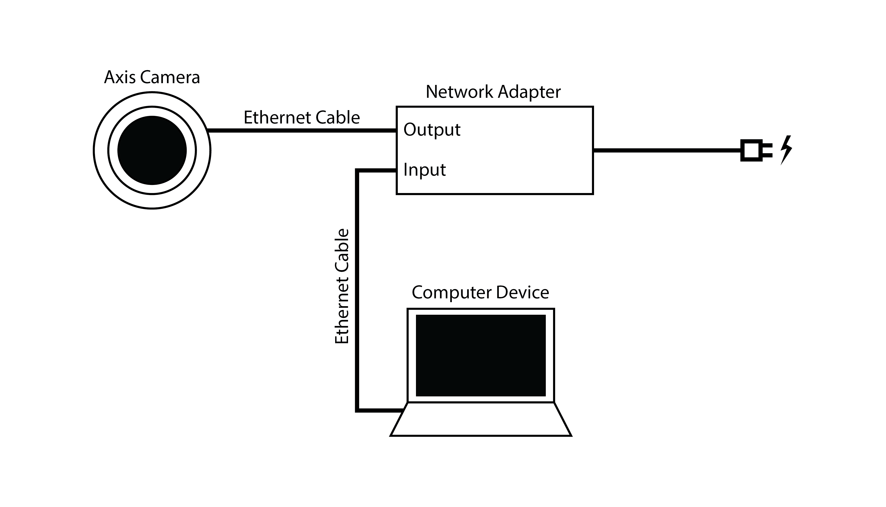

# Camera Module

## Overview
This system connects to a live camera stream, processes each frame using YOLO for people-counting purposes, and saves the output in different log formats (images, videos, text, and CSV).

## Hardware Requirements
* **Camera**: Axis camera (via Axis API)
* **Connector**: Network adapter
* **Cables**: Ethernet cable ×2

### Connections
1. Camera → Adapter (output)
2. Computer → Adapter (input)
3. Adapter → Electrical outlet/socket


## Software Requirements
* Python 3.x (recommended: latest stable version)
* Axis IP Utility / AXIS Utilities
* Required Python libraries (see `requirements.txt`)

## Installation and Setup

### 1. Install Python
Download and install Python 3 from:
https://www.python.org/downloads/

Make sure Python is added to PATH.

### 2. Create a Virtual Environment (Recommended)

#### Windows
```bash
cd Camera
python -m venv venv
venv\Scripts\activate
pip install -r requirements.txt
```

#### macOS/Linux
```bash
cd Camera
python3 -m venv venv
source venv/bin/activate
pip install -r requirements.txt
```

#### Deactivating the Environment
```bash
deactivate
```

### 3. Install Required Libraries (Manual Option)

If you are not using `requirements.txt`, install dependencies manually:

```bash
pip install ultralytics opencv-python pandas requests cvzone
```

## Connecting the Camera

1. Connect the camera to the adapter using a network cable (output port).
2. Connect the computer to the adapter using a network cable (input port).
3. Plug the adapter into a power outlet.
4. Download and install **AXIS Utilities** (Axis IP Utility).
5. Open the program and go to **Settings**.
6. Locate your connected camera (refresh if needed).
7. Copy the camera’s IPv4 address.
8. Paste the IP address into your web browser.
9. Log in using:
   * **Username**: `root`
   * **Password**: `YoloTracking`
10. If the live stream plays, the IP address is correct.

## YOLOv12 Model

This project uses **YOLOv12 (medium)** for people detection.

The required model file (`yolo12m.pt`) is **already included in this repository** and is located in the project root.

No additional download is required.

## Starting the Application via GUI

1. Ensure `yolo12m.pt` is located in the project root.
1. Run `GUI.py` through your IDE or terminal.
2. Enter the camera IPv4 address in the IP input field.
3. Start the stream.

## Output / Data Format
1. All camera outputs are saved in the `/results` directory.
2. Each session has its own folder, named in this format:
ID_yyymmdd_hhmmss_nnnnnn

3. Four types of logs are generated:
   * Image logs (`.png`)
   * Video logs (`.mp4`)
   * Text logs (`.txt`)
   * CSV logs (`.csv`)

4. The CSV logs (used for ML training/testing) contain two columns:
   * **Timestamp**: `YYYY-MM-DD HH:MM:SS.mmm`
   * **Number of people detected**: Integer

## Notes

* If the camera does not appear in AXIS Utilities, refresh the list.
* Make sure your firewall does not block the camera connection.
* Always activate the virtual environment before running the program.

## References

* The original YOLO-based tracking logic (initially YOLOv10) was developed from:
- https://buymeacoffee.com/freedomtech85/e/436287
(Note: This repository is no longer free and now requires payment)
